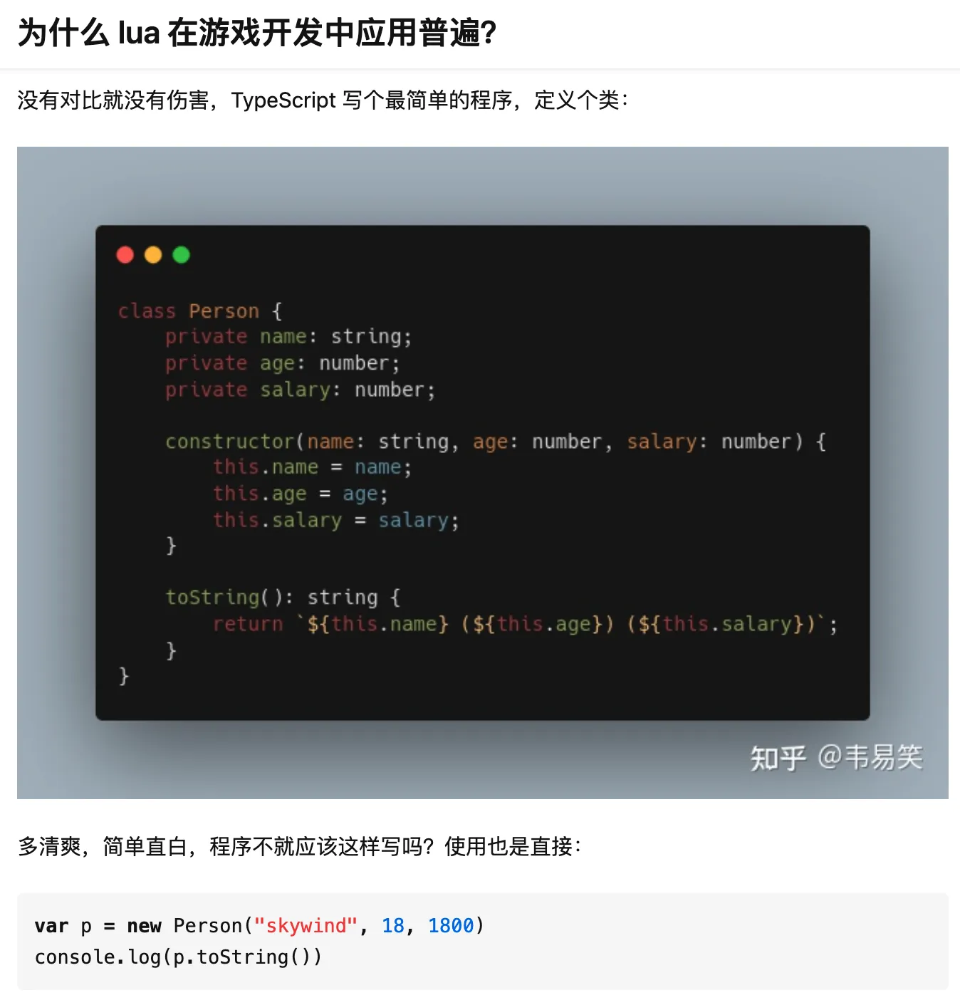
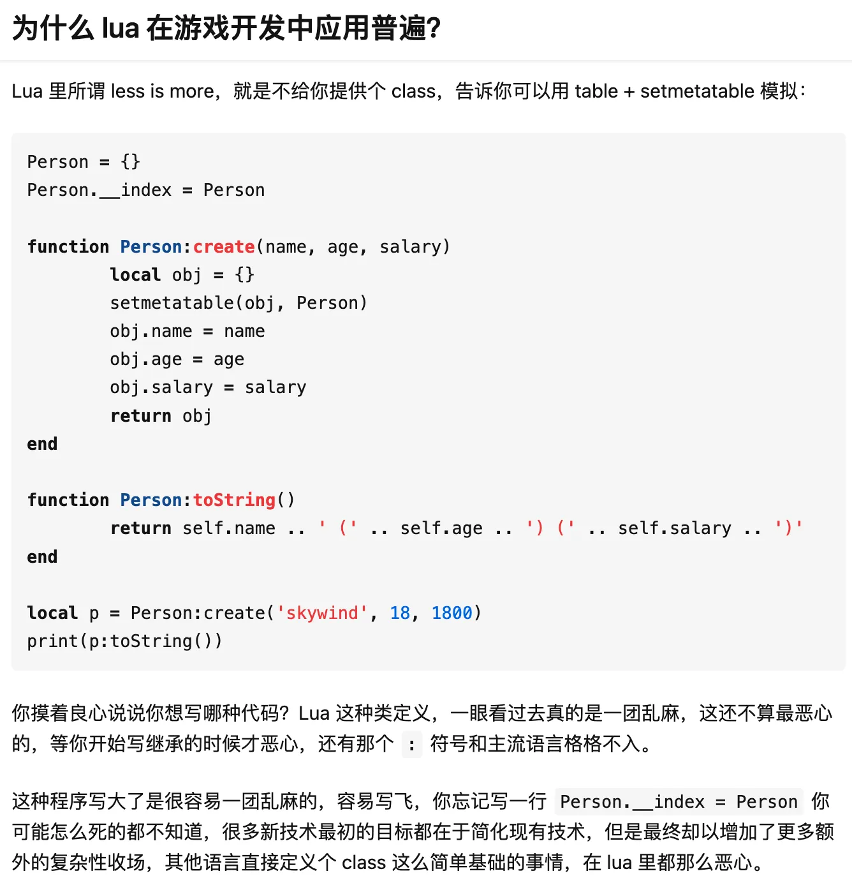

# 一文解决Lua面向对象

在Lua中，有一个让人很头疼的问题，就是Lua的面向对象支持，元表的写法很令人头疼。

我们可以通过这两个图片清晰的看出两个语言面向对象的对比:

（截图自韦亦笑的回答“为什么Lua在游戏开发中应用普遍”）



所以，如何解决Lua面向对象写法上的困难，这是很重要的。

## 元表 -- metatable

Lua中提供了元表特性，用于运算符重载等功能，而我们常见的“Lua实现面向对象”就是通过元表中的`__index`元方法来实现的。

如果你已经在Lua中实现过面向对象了，那你可以跳过本章节，进入下一章节的内容，我们将会深入Lua的面向对象，实现一个面向对象辅助模块，让面向对象变方便。

### 元表中的`__index`元方法

当你通过键来访问`table`的时候，如果这个键没有值且有元表，那么Lua就会寻找该`table`的元表中的`__index` 键。

- 如果`__index`包含一个表格，Lua会在表格中查找相应的键;
- 如果`__index`包含一个函数的话，Lua就会调用那个函数，`table`和键会作为参数传递给函数;
- 如果`__index`是nil，则什么也不会发生;

值得注意的是，元表也可以有元表，所以会产生递归查询，元表里面查不到的时候，会查询元表的元表。

### 通过元表实现简单的面向对象机制 -- 继承

在Lua中，我们可以实现一个`table`，来表示一个类，这个对象我们称为类对象，让他作为衍生对象的元表。比如:
```lua
-- 类对象
Shape = {
    area = 0
}

-- 基础类方法 new
function Shape:new(o,side)
  o = o or {}
  setmetatable(o, self)
  self.__index = self
  side = side or 0
  self.area = side*side;
  return o
end

-- 基础类方法 printArea
function Shape:printArea()
  print("面积为 ",self.area)
end
```

然后我们可以实现另一个`table`，来表示另一个类，设置这个新的类的元表为旧类的元表，我们就继承了旧类的函数。比如:

```lua
Square = Shape:new()
-- 派生类方法 new
function Square:new(o,side)
  o = o or Shape:new(o,side)
  setmetatable(o, self)
  self.__index = self
  return o
end

-- 派生类方法 printArea
function Square:printArea()
  print("正方形面积为 ",self.area)
end
```
这样，我们就手动实现了继承。

当然，这样实现继承的方式有很多问题。比如:

- 需要大量的模式化代码
- 元表实现不太直观
- 数据继承全靠程序员手工维护
- 无法判断一个对象是否是某个类的衍生对象（也即java中的instanceof/c++中的dynamic_cast/c#中的is和as）

为了解决这样的问题，我想我们是可以封装一个函数来帮助我们实现面向对象，杜绝模式化代码的。

## 面向对象辅助模块

如果有一个模块，可以帮我们把模式化代码都做掉呢？那应该会方便很多吧。

如果有一个模块，可以实现全量的面向对象，那应该会方便很多吧。

面向对象模块就是由这个思路而生。

### 设计思路

- 可以定义数据字段
- 可以定义方法字段
- 可以继承
- 可以多继承
- 可以支持判断一个对象是否是某个类的子类 -- instanceof运算符
- 尽量和Lua原有的元表特性不冲突

接口设计:

- 参数是一个table，函数做的就是根据这个table来实现一个类，然后把这个类返回
- 通过参数table的`data`、`inherit`、`inherits`、`methods`、`metafields`等成员，来传递类的元信息
- 通过类的元信息，构造元表

```
structure ClassDef {
    -- father class, inherit is single inheritance,
    -- you can only use one of inherit and inherits
    inherit: ClassObject | nil,
    -- father classes, inherit is multi inheritance,
    -- you can only use one of inherit and inherits
    inherits: List<ClassObject> | nil,
    -- self defined data field, each object of this class will copy this table
    data: Object | nil,
    -- self defined methods, represents metatable field __index
    methods: Table<String, Function> | nil,
    -- self defined metatable fields, for example: __eq, __pairs
    metafields: Table<String, Function> | nil
}
```

```lua
--- # CreateClass
--- Create a class object
---@param classDef table | nil
---@return table classObject
local function CreateClass(classDef)
    -- 省略
end
```

使用举例:

```lua
local BaseObject = CreateClass {
    data = { z = 3 },
    methods = {
        constructor = function(self, z)
            self.z = z
        end
    }
}
local DerivedObject = CreateClass {
    inherit = BaseObject,
    data = { x = 1, y = 2 },
    methods = {
        constructor = function(self, x, y, z)
            self.x = x
            self.y = y
            BaseObject.methods.constructor(self, z)
        end
    }
}
```

### 工具函数

在实际查看函数之前，我们需要介绍几个辅助工具函数，否则可能会导致难以看懂代码。

这些工具函数是:

- merge: 融合多个`table`，返回新的`table`，有重名的场合，后来的`table`覆盖之前的`table`
- deepcopy: 深复制`table`，而不是浅复制`table`
- searchmethod: 递归搜索`methods`

下面是这些工具函数的实现:

```lua
--- Merge two tables, if two tables has same index, then use the latter table's
---
---@param ... table
---@return table
local function merge(...)
    local result = {}
    for _, eachtable in pairs { ... } do
        for k, v in pairs(eachtable) do result[k] = v end
    end
    return result
end

--- Deepcopy a object
---
---@param originalObject table
---@return table
local function deepcopy(originalObject)
    if type(originalObject) == 'table' then
        local copy = {}
        for key, value in next, originalObject, nil do
            copy[deepcopy(key)] = deepcopy(value)
        end
        setmetatable(copy, deepcopy(getmetatable(originalObject)))
        return copy
    else -- number, string, boolean, etc
        return originalObject
    end
end

--- Search a value by key from a list of table
---
---@param key any
---@param tables table
---@return any
local function searchmethod(key, tables)
    for _, super in pairs(tables) do
        if super.methods ~= nil and super.methods[key] then
            return super.methods[key]
        end
    end

    for _, super in pairs(tables) do
        local ret = searchmethod(key, super:superclasses())
        if ret ~= nil then
            return ret
        end
    end
    return nil
end
```

### 继承和多继承

面向对象程序设计中有一个经典的概念，即继承。

Java和C++支持继承特性，可以让一个类继承另一个类，继承别人的衣钵的类，称之为子类，而被继承的类，称之为父类。

子类是父类的扩展，在继承父类提供的功能之上，又做了一层封装。

在我们设计的`CreateClass`函数中，用`inherit`和`inherits`两个命名参数来标识继承和多继承。

代码实现:

```lua
local function CreateClass(classDef)
    --- 省略前面
    local supers = classDef.inherits or { classDef.inherit }
    --- 省略后面
end
```

我们通过`supers`这个`table`，获取了一组父类。
- 不传递`inherit`或者`inherits`时，`supers`会因为Lua的特性，成为长度为0的`table`
- 当`supers`长度为0时，说明该类无父类;
- 当`supers`长度为1时，是单继承;
- 当`supers`长度大于1时，是多继承。

### 继承函数

当一个类继承另一个类时，首当其冲需要继承的，就是函数。之前我们介绍了`__index`元方法，我们可以通过该元方法来实现函数继承。

但不知您之前有没有思考过，如果我们将元表的`__index`强行无理的占用，那么我们就无法实现自定义的`__index`了，而`__index`是取成员运算符和下标运算符的重载函数。这意味着我们如果简单粗暴的占用`__index`，我们就无法实现自定义的map、list等的`operator[]`了。

```lua
local list = CreateClass {
    --- 省略参数
}
local mylist = list:new(1, 2, 3)
local firstElement = mylist[0] --- 不行，因为不提供重写__index的能力

local map = CreateClass {
    --- 省略参数
}
local mymap = map:new({ "Hello" = "World"})
local mapvalue = mymap["Hello"] --- 不行，因为不提供重写__index的能力
```

这就麻烦了，我们只能想办法绕路，来实现可以自定义`__index`，又能继承函数。

最终的解决方法是实现一个`indexer`函数:

- 在查询时，先查询`methods`是否存在该名字的函数
- 然后查询是否存在自定义的`__index`元方法，如果有，调用元方法
  - 分类讨论，是`function`还是`table`
  - 是`table`则查询table
  - 是`function`则调用函数
- 如果自身不存在这样的成员，我们则查找父类`supers`是否存在这样的成员

```lua
-- inheritance of methods, using searchmethod
local indexer = function(self, key)
    -- search methods table first
    local ret = methods[key]
    if ret ~= nil then
        return ret
    end
    -- prevent from searching super's constructor
    if key == "constructor" then
        return nil
    end

    -- search supers and self defined __index latter
    local ret = nil
    -- if self defined __index is not nil, use it
    if type(metafields.__index) == "table" then
        ret = metafields.__index[key]
    elseif type(metafields.__index) == "function" then
        ret = metafields.__index(self, key)
    end
    -- cannot found in self defined __index, fall through to searchmethod
    if ret == nil then
        ret = searchmethod(key, supers)
    end
    return ret
end
```

### 数据的继承

在继承中，数据的继承也是很重要的，当一个类继承另一个类时，子类的对象理所应当也有父类的数据结构。

类是可以层层继承的，而且由于我们支持多继承，那么我们还需要照顾多继承。

最终我们只能通过DFS的方式，通过子类找到父类，层层复制，将每层的数据结构都复制到子类中。

> 这里的DFS比较特殊，不是在一个函数中进行递归的，而是通过层层的继承进行的深度优先遍历

```lua
-- inheritance of data
local function inheritData(classObject)
    local superclassList = GetSuperClassList(classObject)
    for _, superclass in pairs(superclassList) do
        classDef.data = merge(deepcopy(superclass.data), classDef.data)
    end
end
inheritData(classDef)
-- register operator new
classDef.new = function(_, ...)
    local instance = deepcopy(classDef.data)
    -- self defined metatable
    setmetatable(instance, metatable)
    -- self defined constructor
    if instance.constructor ~= nil then
        instance:constructor(...)
    end
    return instance
end
```

数据继承之后，还需要初始化的，有的时候不仅仅需要简单的复制`data`，还需要进行复杂的初始化过程，我们提供了自定义构造函数的功能。

在`methods`中，名为`constructor`的函数是特殊的，当`classObject:new(...)`调用时，会将参数传递给`constructor`进行函数调用，与java、c++中的构造函数类似。

`constructor`函数不会继承父类的，如果你需要调用父类的构造函数，那么你需要使用`superclass.methods.constructor(...)`来显式调用。

### Instanceof运算符的实现

关于父子类的运算符，主要有两种:

- operator is: c#中的is关键字，也是java的instanceof
- operator as: c#中的as关键字，也是c++的dynamic_cast

这两个运算符的功能:

- operator is: 判断一个类是否是另一个类的子类
- operator as: 判断一个类是否是另一个类的子类，同时
    - 如果是子类: 强制转换为那个类，作为运算符的返回值
    - 如果不是则: 返回`null`

由于Lua是动态类型，同时又是鸭子类型，所以我们并不需要实现`as`运算符，因为没有强制类型转换的需要，毕竟所有的所谓`object`都是`table`

> 关于鸭子类型，一个简单的解释是:
> 
> 鸭子类型不关心具体的类型，只关心对象提供的功能，存在叫这个名字的成员，我们就调用之

所以我们准备实现`is`运算符，实现思路主要是这样的:

- 对象提供`getclass`功能，我们可以通过对象获取对象所属的类
- 类提供`getsuperclasses`功能，我们可以通过类获取该类的父类
- 类中存储父类信息，通过查找`class`的父类，来查找该类是否是子类
- 如果父类查不到，则查找父类的父类
- 如此递归查找，直到查询祖宗类（没有父类的类）

```lua
--- # CheckIsSubclass
---
---@param classToCheck table
---@param classObject table
---@return boolean issubclass
local function IsSubclass(classToCheck, classObject)
    if classToCheck == classObject then
        return true
    end
    for _, superclass in pairs(classToCheck:superclasses()) do
        if superclass == classObject or superclass:issubclass(classObject) then
            return true
        end
    end
    return false
end

--- # GetSuperClassList
--- Provide a classObject, return a list of super class
---@param classObject table
---@return table
local function GetSuperClassList(classObject)
    return classObject.inherits or { classObject.inherit }
end

function CreateClass(classDef)
    --- 省略前面
    local methods = merge(classDef.methods, {
        --- 提供从对象获取类的能力
        getclass = function(_)
            return classDef
        end,
        --- 提供从对象获取父类的能力
        getsuperclasses = function(self)
            return self:getclass():superclasses()
        end,
        --- 提供operator is
        instanceof = function(self, classObject)
            return self:getclass():issubclass(classObject)
        end
    })
    --- 省略中间
    -- register operator superclasses
    classDef.superclasses = function(_)
        return GetSuperClassList(classDef)
    end
    -- register operator issubclass
    classDef.issubclass = function(_, classObject)
        return IsSubclass(classDef, classObject)
    end
    --- 省略后面
end
```

### IsClass函数的实现

如果我们需要判断一个对象是否是类对象，如何解决？

解决方案:

- 每次`CreateClass`时，将`classObject`储存于一个`Set`中，这里我们使用`table`来模拟`Set`的功能
- 查询`IsClass`时，查找`classSet`中是否存在这个类
  - 存在则返回`true`
  - 不存在则返回`false`

```lua
local classSet = {}
local dummyVal = {}

function CreateClass(classDef)
    --- 省略前面
    -- register classObject to classSet
    classSet[classDef] = dummyVal

    return classDef
end

--- # IsClass
--- Check a object is class object or not
---@param classObject table
---@return boolean
function IsClass(classObject)
    if classSet[classObject] ~= nil then
        return true
    end
    return false
end
```

### 纯虚函数的实现/`interface`的实现

由于我们提供了多继承的方式，我们只需要实现纯虚函数就能很方便的实现interface的功能

```lua
--- # PureVirtual
--- - PureVirtual function,
--- - Using this function, we can simulate pure virtual function in c plus plus
function PureVirtual()
    error("Hit pure virtual function! Your class should override this fucntion.")
end
```

### 自定义元方法的实现

我们提供了自定义元方法的实现，可以最大程度的不与Lua本身的元表机制冲突，同时，还做到了继承元方法。

实现思路:

- 通过`classdef`的`metafields`成员传递元方法
- 通过DFS进行元方法的继承

> 这里的DFS比较特殊，不是在一个函数中进行递归的，而是通过层层的继承进行的深度优先遍历

```lua
function CreateClass(classDef)
    --- 省略前面
    -- provide self defined metafields
    local metafields = classDef.metafields
    -- inheritance of metafields
    local function inheritMetafields(classObject)
        local superclassList = GetSuperClassList(classObject)
        for _, superclass in pairs(superclassList) do
            metafields = merge(deepcopy(superclass.metafields), metafields)
        end
    end
    inheritMetafields(classDef)
    --- 省略中间
    -- provide self defined class metatable
    local metatable = merge(metafields, { __index = indexer })
    --- 省略后面
end
```

## 总结

实现一个模拟的面向对象机制实在是太复杂了，其实我一开始只是想着能不能实现一个简单的面向对象机制，但在实际编写的过程中，发现需要考虑的 corner case 太多了，最终变成了如此复杂的一个模块，但他很好的实现了我所需要的功能。

## 使用示例

回到最初，最开始的示例代码如何用我们的模块实现呢？

```lua
local class = require("class")

local shape = class.CreateClass {
    data = { area = 0 },
    methods = {
        constructor = function(self, side)
            local side = side or 0
            self.area = side * side
        end,
        printArea = function(self)
            print("面积为 ",self.area)
        end
    }
}

return shape
```

```lua
local class = require("class")

local Shape = require("shape")

local square = class.CreateClass {
    inherit = Shape,
    methods = {
        constructor = function(self, side)
            Shape.methods.constructor(self, side)
        end,
        printArea = function(self)
            print("正方形面积为 ",self.area)
        end
    }
}

return square
```

## 模块源代码

```lua
--- Search a value by key from a list of table
---
---@param key any
---@param tables table
---@return any
local function searchmethod(key, tables)
    for _, super in pairs(tables) do
        if super.methods ~= nil and super.methods[key] then
            return super.methods[key]
        end
    end

    for _, super in pairs(tables) do
        local ret = searchmethod(key, super:superclasses())
        if ret ~= nil then
            return ret
        end
    end
    return nil
end

--- Merge two tables, if two tables has same index, then use the latter table's
---
---@param ... table
---@return table
local function merge(...)
    local result = {}
    for _, eachtable in pairs { ... } do
        for k, v in pairs(eachtable) do result[k] = v end
    end
    return result
end

--- Deepcopy a object
---
---@param originalObject table
---@return table
local function deepcopy(originalObject)
    if type(originalObject) == 'table' then
        local copy = {}
        for key, value in next, originalObject, nil do
            copy[deepcopy(key)] = deepcopy(value)
        end
        setmetatable(copy, deepcopy(getmetatable(originalObject)))
        return copy
    else -- number, string, boolean, etc
        return originalObject
    end
end

--- # GetSuperClassList
--- Provide a classObject, return a list of super class
---
--- ## Example
--- ```lua
--- local BaseObject = class()
---
--- local DerivedObject = class({
---     inherit = BaseObject,
---     constructor = function(self, x, y)
---         self.x = x
---         self.y = y
---     end
--- })
--- local superclasses = GetSuperClassList(DerivedObject) -- { BaseObject }
--- ```
---@param classObject table
---@return table
local function GetSuperClassList(classObject)
    return classObject.inherits or { classObject.inherit }
end

--- # CheckIsSubclass
---
--- ## Example
--- ```lua
--- local BaseObject = CreateClass()
--- local DerivedObject = CreateClass({ inherit = BaseObject })
---
--- assert(IsSubclass(DerivedObject, BaseObject)) -- no error throw
--- ```
---@param classToCheck table
---@param classObject table
---@return boolean issubclass
local function IsSubclass(classToCheck, classObject)
    if classToCheck == classObject then
        return true
    end
    for _, superclass in pairs(classToCheck:superclasses()) do
        if superclass == classObject or superclass:issubclass(classObject) then
            return true
        end
    end
    return false
end

local classSet = {}
local dummyVal = {}

--- # CreateClass
--- Create a class object
---
--- ## Example
--- ```lua
--- local BaseObject = CreateClass({
---     data = { z = 3 }
--- })
---
--- local DerivedObject = CreateClass({
---     inherit = BaseObject,
---     data = { data = 0, x = 1, y = 2 },
---     methods = {
---         constructor = function(self, x, y)
---             self.x = x
---             self.y = y
---         end
---     },
--- })
---
--- local json = require("json")
--- print(json:encode(DerivedObject:new(1, 2))) -- {"data":0,"x":1,"y":2,"z":3}
--- ```
---
--- ## Parameter structure
--- ```
--- structure ClassDef {
---     -- father class, inherit is single inheritance,
---     -- you can only use one of inherit and inherits
---     inherit: ClassObject | nil,
---     -- father classes, inherits is multi inheritance,
---     -- you can only use one of inherit and inherits
---     inherits: List<ClassObject> | nil,
---     -- self defined data field, each object of this class will copy this table
---     data: Object | nil,
---     -- self defined methods, represents metatable field __index
---     methods: Table<String, Function> | nil,
---     -- self defined metatable fields, for example: __eq, __pairs
---     metafields: Table<String, Function> | nil
--- }
--- ```
---@param classDef table | nil
---@return table classObject
local function CreateClass(classDef)
    -- you can skip classDef and we would use a default value
    local classDef = classDef or {}
    -- multi inherit use inherits and single inherit use inherit
    local supers = classDef.inherits or { classDef.inherit }
    -- provide self defined metafields
    local metafields = classDef.metafields
    -- inheritance of metafields
    local function inheritMetafields(classObject)
        local superclassList = GetSuperClassList(classObject)
        for _, superclass in pairs(superclassList) do
            metafields = merge(deepcopy(superclass.metafields), metafields)
        end
    end
    inheritMetafields(classDef)
    -- provide self defined methods
    local methods = merge(classDef.methods, {
        getclass = function(_)
            return classDef
        end,
        getsuperclasses = function(self)
            return self:getclass():superclasses()
        end,
        instanceof = function(self, classObject)
            return self:getclass():issubclass(classObject)
        end
    })
    -- inheritance of methods, using searchmethod
    local indexer = function(self, key)
        -- search methods table first
        local ret = methods[key]
        if ret ~= nil then
            return ret
        end
        -- prevent from searching super's constructor
        if key == "constructor" then
            return nil
        end

        -- search supers and self defined __index latter
        local ret = nil
        -- if self defined __index is not nil, use it
        if type(metafields.__index) == "table" then
            ret = metafields.__index[key]
        elseif type(metafields.__index) == "function" then
            ret = metafields.__index(self, key)
        end
        -- cannot found in self defined __index, fall through to searchmethod
        if ret == nil then
            ret = searchmethod(key, supers)
        end
        return ret
    end
    -- provide self defined class metatable
    local metatable = merge(metafields, { __index = indexer })
    -- inheritance of data
    local function inheritData(classObject)
        local superclassList = GetSuperClassList(classObject)
        for _, superclass in pairs(superclassList) do
            classDef.data = merge(deepcopy(superclass.data), classDef.data)
        end
    end
    inheritData(classDef)

    -- register operator superclasses
    classDef.superclasses = function(_)
        return GetSuperClassList(classDef)
    end
    -- register operator issubclass
    classDef.issubclass = function(_, classObject)
        return IsSubclass(classDef, classObject)
    end
    -- register operator constructor
    classDef.getconstructor = function(_)
        return classDef.methods.constructor
    end
    -- register operator new
    classDef.new = function(_, ...)
        local instance = deepcopy(classDef.data)
        -- self defined metatable
        setmetatable(instance, metatable)
        -- self defined constructor
        if instance.constructor ~= nil then
            instance:constructor(...)
        end
        return instance
    end

    -- register classObject to classSet
    classSet[classDef] = dummyVal

    return classDef
end

--- # IsClass
--- Check a object is class object or not
---
--- ## Example
--- ```lua
--- local BaseObject = class.CreateClass({
---     data = { z = 3 }
--- })
--- assert(class.IsClass(BaseObject)) -- no error throw
--- ```
---@param classObject table
---@return boolean
local function IsClass(classObject)
    return classSet[classObject] ~= nil
end

--- # PureVirtual
--- - PureVirtual function,
--- - Using this function, we can simulate pure virtual function in c plus plus
local function PureVirtual()
    error("Hit pure virtual function! Your class should override this fucntion.")
end

return {
    IsClass = IsClass,
    CreateClass = CreateClass,
    PureVirtual = PureVirtual,
}
```
